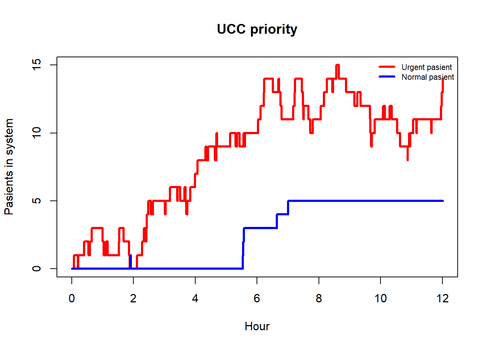

# Urgent-Care-Queue-Simulation

View the entire project:

https://adrianlund2003.github.io/Urgent-Care-Queue-Simulation/Besvarelse

In this project, we simulate a waiting line at an urgent care center (UCC) staffed by a single doctor who can treat only one patient at a time.

There are two types of patients: normal and urgent. Urgent patients have priority over normal patients. This means that urgent patients are always served before normal patients.

If an urgent patient arrives while a normal patient is being treated, the ongoing treatment is immediately interrupted, and the doctor begins treating the urgent patient instead. The interrupted normal patient returns to the queue and will resume treatment once no urgent patients remain.

In queueing theory this is called a premptive-resume priority queue.

### Structure

The project is organized into two main components: an R script containing all core functionality, and an R Notebook used for simulation, analysis, and documentation.

- **Funksjoner.R**
Contains all R functions used in the project. This includes the implementation of the queueing system and performance metrics.

- **Besvarelse.Rmd**
An R Notebook that sources the functions from Funksjoner.R. The notebook is used to run simulations, analyze results, and provide explanations of the model and findings.

- **Besvarelse.html**
The rendered HTML output generated by knitting Besvarelse.Rmd. This file presents the simulation results and explanations in a readable format.

### Key results

*Figure 1: The UCC-queue the first 12 simulated hours.*

### Academic context

This project was given to the students in the course **TMA4265 Stochastic Modelling (fall 2025)**.

Language: *English*

Collaborators:

- [andrea14](https://github.com/andrea14)
- [Haakan03](https://github.com/Haakan03)
